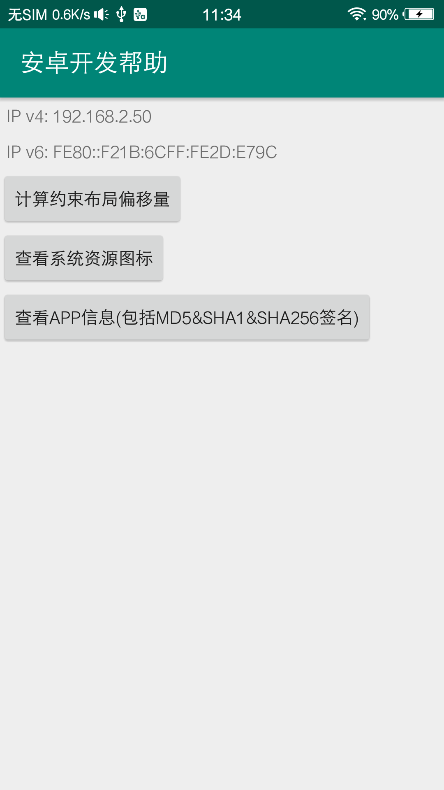

# DevelopHelper
 Android开发帮助类, 我主要用来计算约束布局的偏移量
 <a href="https://github.com/actor20170211030627/DevelopHelper">项目地址</a>
 
 ## Screenshot
 </img>
 </img>  
 </img>
 
 ## Demo
 <a href="https://github.com/actor20170211030627/DevelopHelper/raw/master/app/build/outputs/apk/debug/app-debug.apk">download apk</a> or scan qrcode:  
 </img>
 
 ## TODO
     1.增加频pinyin4jar, 对AppInfoActivity中的app进行排序
     2.增加更多功能...