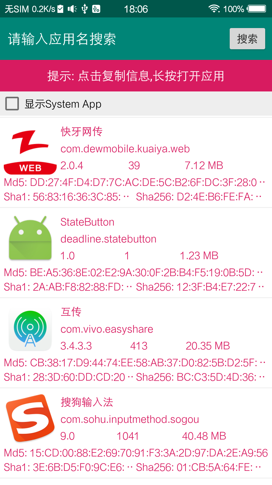

## DevelopHelper
> <a href="https://github.com/actor20170211030627/DevelopHelper"><s>Github(网速慢,不再维护 Deprecated)</s></a>  
> <a href="https://gitee.com/actor20170211030627/DevelopHelper">Gitee码云(国内网速更快)</a>

### Android开发帮助类, 我主要用来计算约束布局的偏移率

## Screenshot
 </img>
 </img>  
 </img>
 
## Demo
 <a href="app/build/outputs/apk/debug/app-debug.apk">download apk</a> or scan qrcode:  
 </img>
 